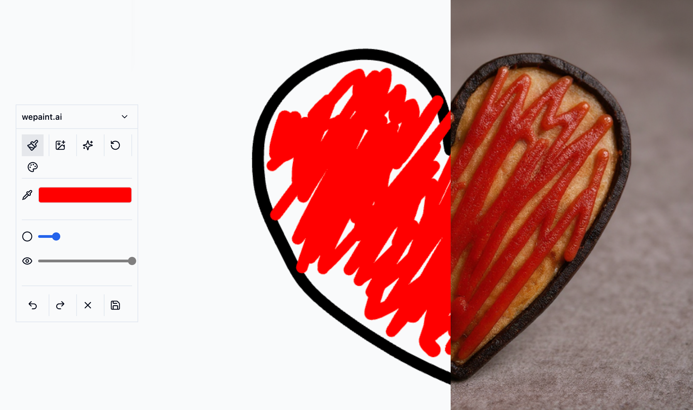

# wePaintAI 🎨

A real-time collaborative painting app with AI-powered image generation, built with React 19, Convex, and Konva.js. Turn your sketches into stunning AI-generated artwork!



## ✨ Features

- **🎨 Real-time Collaborative Painting** - Draw together with friends in real-time using WebSocket connections
- **🤖 AI Image Generation** - Transform your canvas sketches into AI-generated images using Replicate's Flux Kontext Pro
- **🖼️ Layer Management** - Work with multiple layers including paint, uploaded images, and AI-generated content
- **🛠️ Advanced Drawing Tools** - Brush, eraser, pan tool with customizable sizes and opacity
- **📱 Responsive Design** - Works seamlessly on desktop and mobile devices
- **🔗 URL-based Sharing** - Share your painting session with a simple link
- **👥 Live Presence** - See cursors and activity of other users in real-time
- **📸 Image Upload** - Add images to your canvas via upload or drag-and-drop
- **⚡ Optimistic Updates** - Instant visual feedback with local-first architecture

## 🚀 Quick Start

### Prerequisites

- Node.js (v18+ recommended)
- pnpm package manager
- Convex account (free tier available for local development)
- Clerk account for authentication (optional for local dev)

### Installation

1. **Clone the repository:**
   ```bash
   git clone https://github.com/yourusername/wepaintai.git
   cd wepaintai
   ```

2. **Install dependencies:**
   ```bash
   pnpm install
   ```

3. **Set up environment variables:**
   Create a `.env.local` file:
   ```bash
   # Required for authentication (get from Clerk dashboard)
   VITE_CLERK_PUBLISHABLE_KEY=your_clerk_publishable_key
   VITE_CLERK_FRONTEND_API_URL=your_clerk_frontend_api_url
   
   # For local development (disable auth)
   VITE_AUTH_DISABLED=true
   
   # Convex URL (auto-set by dev commands)
   VITE_CONVEX_URL=http://127.0.0.1:3210
   ```

4. **Run locally with free local backend:**
   ```bash
   pnpm dev
   ```
   
   This starts both the frontend (http://localhost:5173) and a local Convex backend - no cloud services needed!

## 🛠️ Development

### Available Scripts

```bash
# Development
pnpm dev              # Local dev with local Convex backend (free, recommended)
pnpm dev:cloud        # Local dev with cloud Convex backend
pnpm dev:prod-db      # Local dev with production database (use carefully!)

# Build & Deploy
pnpm build            # Build for production
pnpm start            # Start production server
npx convex deploy     # Deploy backend to Convex cloud
```

### Tech Stack

- **Frontend**: TanStack Start (React 19 + file-based routing)
- **Canvas**: Konva.js for high-performance 2D graphics
- **Backend**: Convex (real-time serverless database)
- **Authentication**: Clerk (optional, can be disabled for local dev)
- **AI**: Replicate API (Flux Kontext Pro model)
- **Styling**: Tailwind CSS
- **Language**: TypeScript

### Project Structure

```
/app
  /routes         # File-based routing
  /components     # React components (Canvas, ToolPanel, etc.)
  /hooks          # Custom React hooks
/convex
  /functions      # Backend functions (queries, mutations)
  schema.ts       # Database schema
/public           # Static assets
```

## 🎨 Features in Detail

### Real-time Collaboration
- WebSocket-based synchronization using Convex
- Optimistic updates for instant feedback
- Presence system shows live cursors
- URL-based session sharing

### AI Image Generation
- Powered by Replicate's Flux Kontext Pro model
- Adjustable canvas influence (0-100% weight)
- Seamless integration with the painting canvas
- Generated images become new layers

### Layer System
- **Paint Layer**: All brush strokes combined
- **Image Layers**: Uploaded images
- **AI Layers**: AI-generated images
- Adjustable opacity and visibility
- Drag-to-reorder functionality

### Drawing Tools
- **Brush (B)**: Variable size painting
- **Eraser (E)**: Works on active layer
- **Pan (H)**: Move image layers
- **Upload (U)**: Add images to canvas
- **AI Generate (G)**: Create AI images

## 🤝 Contributing

We welcome contributions! Whether you're fixing bugs, adding features, or improving documentation, your help is appreciated.

1. Fork the repository
2. Create your feature branch (`git checkout -b feature/amazing-feature`)
3. Commit your changes (`git commit -m 'Add amazing feature'`)
4. Push to the branch (`git push origin feature/amazing-feature`)
5. Open a Pull Request

### Ideas for Contribution

- 🎨 New drawing tools (shapes, text, patterns)
- 🖌️ Brush presets and custom brushes
- 🎯 Selection tools and transformations
- 📊 Drawing history and version control
- 🌍 Internationalization support
- 🎭 Filters and effects
- 📱 Mobile app version
- 🔌 Plugin system for extensibility

## 🐛 Known Issues

- AI generation requires Replicate API token (see setup docs)
- Some content may be flagged by moderation - try different prompts
- Local storage limited to browser session in development

## 📚 Documentation

For detailed setup and configuration:
- [Authentication Setup](CLAUDE.md#authentication-setup)
- [Environment Variables](CLAUDE.md#environment-variables)
- [AI Configuration](CLAUDE.md#ai-image-generation)
- [Development Notes](CLAUDE.md#development-notes)

## 🔐 Security

- Never commit API keys or secrets
- Use environment variables for sensitive data
- Authentication can be disabled for local development only
- See [Security Best Practices](CLAUDE.md#development-notes)

## 📄 License

This project is licensed under the MIT License - see the [LICENSE](LICENSE) file for details.

## 🙏 Acknowledgments

- [Convex](https://convex.dev) for the amazing real-time backend
- [Konva.js](https://konvajs.org) for powerful canvas capabilities
- [Replicate](https://replicate.com) for AI image generation
- [Clerk](https://clerk.com) for authentication
- [perfect-freehand](https://github.com/steveruizok/perfect-freehand) for smooth drawing
- The open source community for inspiration and support

## 🌟 Star History

If you find this project useful, please consider giving it a star! It helps others discover the project and motivates continued development.

---

**Ready to paint with AI?** Clone the repo and start creating! 🚀

For questions and discussions, feel free to open an issue or start a discussion in the GitHub repository.