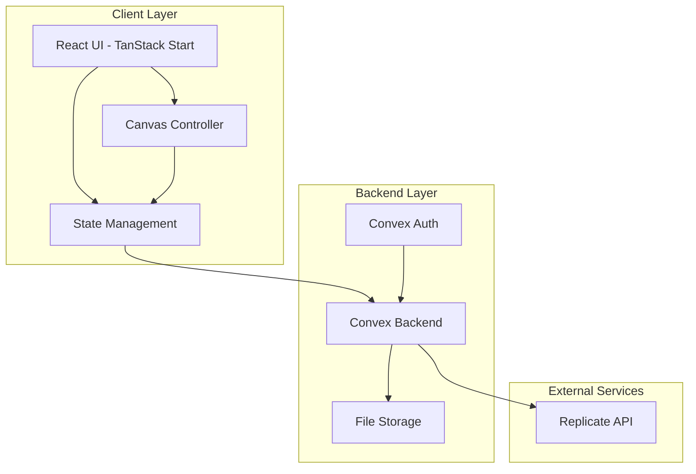
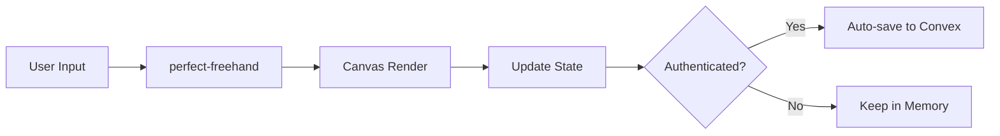
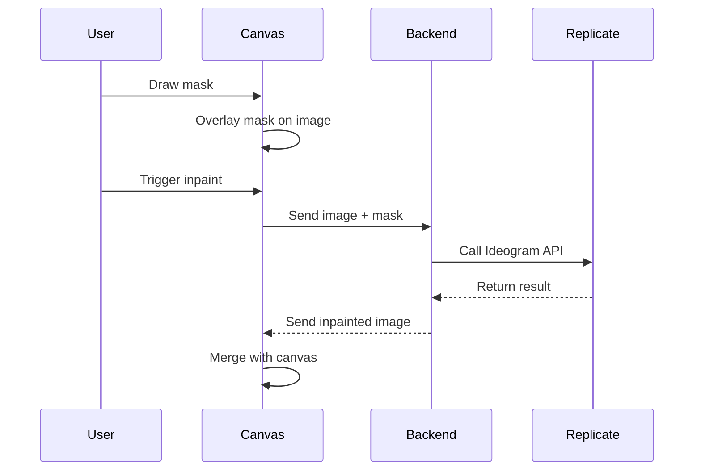

# iPaintAI - System Patterns

## Architecture Overview



## Key Technical Decisions

### 1. Canvas Architecture
- **Pattern**: Single Canvas with State Management
- **Implementation**: HTML5 Canvas API with React refs
- **Drawing Engine**: perfect-freehand for stroke processing
- **Rationale**: Direct canvas manipulation for performance

### 2. State Management Pattern
```typescript
// Canvas state structure
interface CanvasState {
  strokes: Stroke[]
  currentStroke: Stroke | null
  history: HistoryStack
  tool: ToolType
  toolSettings: ToolSettings
}

// Separate concerns
- UI State (React Context)
- Canvas State (React State)
- Persistent State (Convex)
```

### 3. Drawing Pipeline


### 4. Inpainting Workflow


## Component Relationships

### Core Components
1. **App.tsx** - Root component, routing setup
2. **CanvasView** - Main painting interface
3. **ToolPanel** - Tool selection and settings
4. **AuthModal** - Authentication flow
5. **Canvas** - Core drawing component

### Component Communication
- **Props Down**: Tool settings, auth state
- **Events Up**: Canvas actions, tool changes
- **Context**: Global UI state, theme
- **Convex Hooks**: Data fetching, mutations

## Critical Implementation Paths

### 1. Drawing Performance
```typescript
// Optimize rendering with RAF
const draw = useCallback(() => {
  if (!isDrawing) return
  
  requestAnimationFrame(() => {
    // Render only changed portions
    renderStroke(currentStroke)
  })
}, [isDrawing, currentStroke])
```

### 2. Auto-save Strategy
```typescript
// Debounced save with diff detection
const saveCanvas = useMutation(api.paintings.save)
const debouncedSave = useDebouncedCallback(
  async (canvasData) => {
    if (!isAuthenticated) return
    await saveCanvas({ imageData: canvasData })
  },
  30000 // 30 seconds
)
```

### 3. Inpainting Integration
```typescript
// Mask to inpaint flow
const handleInpaint = async (maskCanvas: HTMLCanvasElement) => {
  // 1. Merge mask with original
  const imageData = mergeCanvases(mainCanvas, maskCanvas)
  
  // 2. Call backend
  const result = await inpaintMutation({
    image: imageData,
    mask: maskData
  })
  
  // 3. Apply result
  applyInpaintResult(result)
}
```

## Design Patterns in Use

1. **Command Pattern** - Undo/Redo implementation
2. **Observer Pattern** - Canvas state changes
3. **Strategy Pattern** - Tool behaviors
4. **Facade Pattern** - Convex API wrapper
5. **Debounce Pattern** - Auto-save optimization

## Data Flow Patterns

### Unidirectional Data Flow
```
User Action → State Update → Canvas Render → Side Effects (Save)
```

### Authentication Flow
```
Anonymous Use → Optional Sign In → Token Storage → Enhanced Features
```

### Error Handling
```
Try Operation → Catch Error → User Feedback → Fallback Behavior